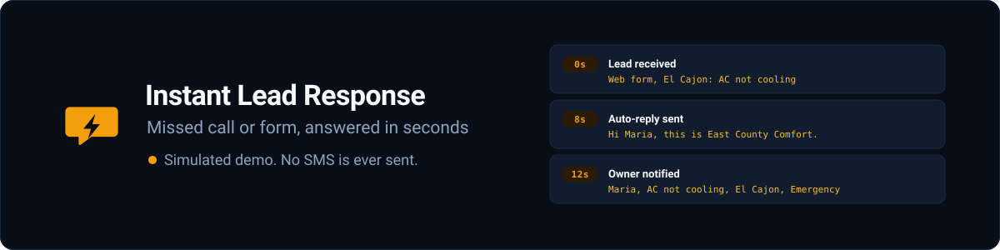
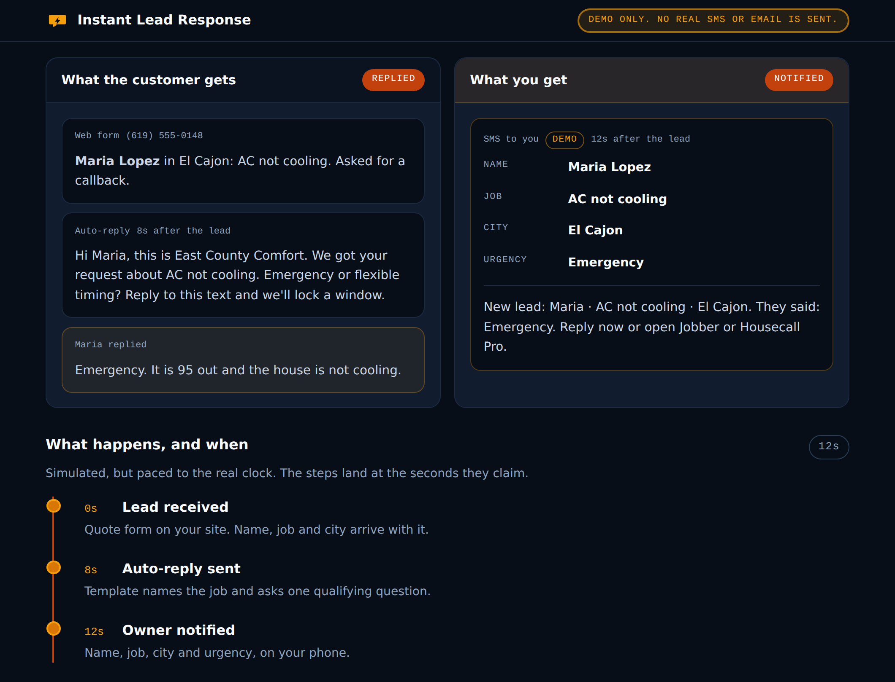

<p align="center">
  
</p>

<p align="center">
  <a href="https://github.com/IgorCSIS/instant-lead-response/actions"></a>
  
  
  
  
</p>

# Instant Lead Response: missed call text-back and owner SMS for trades

A one-page demo of what happens to a lead in the first twelve seconds, built
for HVAC and plumbing owners in El Cajon and the rest of East County San
Diego. A homeowner fills in your quote form, or calls and hangs up, while you
are on a roof in Santee. Press one button and watch what a real install does
next: the customer gets a text back that names the job and asks one
qualifying question, and your phone buzzes with the name, the job, the city
and how hot it is. You never climbed down.

It runs entirely in your browser. No account, no API key, no backend, and
nothing is ever sent.

**Live demo:** https://igorcsis.github.io/instant-lead-response/  
**Stack:** hand-written HTML, CSS and JavaScript. No build step, no
dependencies, nothing to install.

<p align="center">
  
</p>

## What this is, and what it is not

**It is** a sales demo and a working illustration. It shows an owner, in
about twelve seconds, the shape of a service they can buy: a fast reply to
the customer, one qualifying question, and a notification that reaches them
on a job site.

**It is not** a messaging product, and it deliberately cannot become one:

- **The SMS is simulated.** Nothing on this page sends anything. There is no
  Twilio, no HighLevel, no queue, no webhook, and no third party script.
- **There is no network code at all.** No `fetch`, no form post, no
  analytics, no web font. Open the network tab and watch: after the page
  and its two files load, nothing else goes out.
- **It stores nothing.** No cookies, no `localStorage`, no session. Reload
  and it is exactly as a stranger finds it.
- **It is not a CRM, and it does not replace one.** There is no login, no
  migration, no dispatch, no quoting and no invoicing. Your Jobber or
  Housecall Pro stays the system of record.

That is deliberate rather than unfinished. A page that could really text a
homeowner would need a registered brand, a paid number and a backend, and
none of that belongs in a link you paste into a text message.

The honesty chip lives in a sticky header, so it is on screen at every scroll
position rather than only at the top, and the timeline says its own timing is
simulated.

## Stack decision

| Layer | Choice | Why |
| --- | --- | --- |
| Page | One hand-written `index.html` | The whole demo is one screen. A framework would be more machinery than the thing it renders |
| Styling | Plain CSS with custom properties | No build means no purge step, and no purge step means a class built at runtime cannot be silently dropped from the stylesheet |
| Behaviour | One IIFE in `app.js`, no dependencies | Nothing to audit, nothing to update, nothing that can pull a supply chain in behind it |
| Timing | Paced to the real clock | The claim is about speed. Collapsing twelve seconds into two would be arguing against it |
| Art | SVG for the banner and logo, one rasterized PNG for the social card | Vector stays sharp at any size and costs no bytes to scale; Open Graph consumers only accept a raster |
| Hosting | GitHub Pages, repository root uploaded as-is | What is in the repository is what is served. Free forever, nothing to renew |
| Messaging | None | See above. There is no messaging |

## The two ways a lead arrives

The segmented control at the top switches between them, and they are
genuinely different, which is the point:

**Web form.** The lead hands you the name, the job and the city up front.
The auto-reply can name the job in its first sentence, which is what makes a
reply read as written by a person, and the one qualifying question is about
urgency.

**Missed call.** The phone rings out after twenty two seconds. No voicemail,
no name, nothing but the number. The text back has to ask what is going on
before there is anything to dispatch, and the owner's notification leads with
the number rather than a name. This is the case owners lose most often, so it
gets equal billing rather than a footnote.

Switching between them clears the timeline and both panels. Leaving a web
form thread on screen under a Missed call heading would be the one dishonest
thing on the page.

## What a real install is

The demo is the shop window, not the product. A real install is done-for-you
and runs on tools that already exist:

- **HighLevel** for most shops, because the messaging, the pipeline and the
  templates are already in one place, or
- **a leaner Twilio setup** when someone only wants the missed-call
  text-back and the owner notify and nothing else.

Either way there is **A2P 10DLC registration** in the middle of it. US
carriers require a registered brand and campaign before application-to-person
texting is allowed to send, and that registration takes days, not minutes. It
is the reason the offer is priced as a deposit plus a second payment when the
SMS is actually cleared and sending, rather than a single payment on day one.

Your Jobber or Housecall Pro stays exactly where it is. This sits on top of
the system of record you already pay for.

## Running it locally

There is no build step and nothing to install. The repository is the site.

```sh
git clone https://github.com/IgorCSIS/instant-lead-response.git
cd instant-lead-response
python3 -m http.server 8000
```

Then open http://localhost:8000.

Opening `index.html` straight off disk works too. The page uses no modules,
no fetch and no storage, so there is nothing for a `file://` origin to trip
over.

`app.js` exposes `window.instantLeadDemo` so a run can be driven from the
console or a headless browser without clicking:

```js
instantLeadDemo.select("call");   // switch to the missed call path
await instantLeadDemo.run();      // walk the timeline
instantLeadDemo.clock;            // { replyDone: 8000, notifyDone: 12000, ... }
```

## Accessibility, and what reduced motion does

The run reports itself through a single `role="status"` live region, so a
screen reader gets the same progress the timeline shows. At rest that region
carries the honesty line, which puts it directly under the button that starts
the demo. The button carries `aria-busy` while a run is in flight and cannot
be double fired, and the source control locks with it. The segmented control
is a real `radiogroup` with arrow key support. Every tap target is at least
44px and every focusable thing has a visible focus ring.

The elapsed counter is hidden from assistive technology on purpose. The
status region already announces each stage, and a number updating ten times a
second would talk over it.

With `prefers-reduced-motion: reduce` set, every step still runs in order and
lands in the same end state, it just arrives without the staging.

Every text and background pair that ships was measured against its real
rendered colour rather than eyeballed. All of them meet WCAG AA.

## Layout

```
.
├── index.html                  The whole page. One file, no templating
├── styles.css                  Hand-written CSS custom properties
├── app.js                      The simulation. One IIFE, no dependencies
├── assets/
│   ├── logo.svg                32x32 mark, a speech bubble and a bolt
│   ├── favicon.svg             The same mark, as the tab icon
│   ├── banner.svg              1200x300 README banner
│   ├── og-image.html           Source for the social card
│   ├── og-image.png            1200x630, rasterized from the above
│   └── screenshot.png          The finished demo, for this README
├── scripts/
│   └── make-og-image.mjs       Regenerates og-image.png. Run by hand
└── .github/workflows/
    └── deploy.yml              Uploads the repository root to Pages
```

`scripts/make-og-image.mjs` is deliberately not wired into the deploy
workflow. The PNG is committed, so shipping the site needs neither the script
nor a browser.

## The data in the demo

Every name, number and company in it is invented. Maria Lopez is not a
person, East County Comfort is not a company, and `(619) 555-0148` is inside
the 555-0100 to 555-0199 block reserved for fiction, so it cannot ring
anybody. There is no real customer data in this repository, because there is
nowhere for real customer data to go.

The clocks on the timeline are the targets a live install is set up to hit,
and the demo really does take twelve seconds to reach the last one. The
labels are not decoration.

## Want this on your own phone

Done-for-you install for East County trades: missed-call text-back, form
qualify and owner SMS, on top of Jobber or Housecall Pro. $997, as a $497
deposit and $500 when your SMS is live and sending. Optional light support at
$149 a month. You keep paying your own messaging usage.

niftystudiodesigns@gmail.com

## License

MIT. See [LICENSE](LICENSE).

Built by **Igor Lima**. Automation and web work for East County and San Diego
businesses. Portfolio: https://igorcsis.github.io/niftyai-portfolio/
